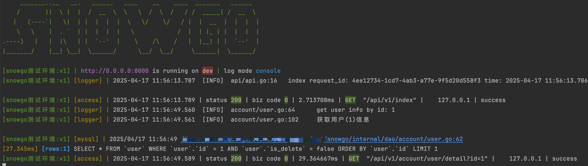

<div align="center">

<h1>snowgo</h1>

<p>基于 <b>Gin + GORM Gen</b> 的高可用、模块化 Go Web 脚手架，企业级基础设施集成，快速构建后台管理系统与 RESTful API 服务</p>

<p>
  <a href="https://github.com/sy159/snowgo/actions/workflows/lint_code.yml"></a>
  <a href="https://github.com/sy159/snowgo/actions/workflows/security.yml"></a>
  <a href="https://go.dev/"></a>
  <a href="https://pkg.go.dev/github.com/gin-gonic/gin"></a>
  <a href="https://pkg.go.dev/gorm.io/gorm"></a>
  
</p>

</div>

---

## 📑 目录

- [✨ 特性概览](#-特性概览)
- [🏗️ 架构设计](#️-架构设计)
- [📂 项目结构](#-项目结构)
- [🚀 快速开始](#-快速开始)
- [🛠️ 常用命令](#️-常用命令)
- [🔌 服务入口](#-服务入口)
- [🧩 中间件清单](#-中间件清单)
- [🏥 健康检查](#-健康检查)
- [📐 新业务功能开发流程](#-新业务功能开发流程)
- [🌍 环境变量](#-环境变量)
- [🔄 CI / CD](#--ci--cd)
- [📖 文档 & 参考](#-文档--参考)
- [📄 许可证](#-许可证)

---

## ✨ 特性概览

| 模块         | 组件                        | 描述 |
|:------------ |:--------------------------- |:---- |
| 🌐 Web 框架 | Gin | 高性能 HTTP 框架 |
| ⚙️ 配置管理 | Viper | 多环境配置文件（dev / container / uat / prod） |
| 📜 日志系统 | Zap + RotateLogs + ELK | 结构化日志，支持文件轮转与脱敏输出；可选集成 ELK |
| 🗄️ 数据访问 | GORM + Gen + dbresolver | ORM 工具，支持读写分离、多数据库配置；Model/Query 代码自动生成 |
| 🚀 缓存系统 | go-redis | Redis 客户端封装，支持缓存与分布式锁 |
| 🔐 鉴权系统 | JWT v5 | access_token / refresh_token 双 Token 鉴权，refresh_token 单用+JTI 追踪 |
| 🛂 权限系统 | 自定义 RBAC | 基于菜单树结构的按钮/接口级权限控制 |
| 🛡️ 限流中间件 | Fixed Window + Token Bucket | 固定窗口（Redis 原子计数）+ 令牌桶（内存速率控制）；支持 IP 白名单、路由级限流、Key 级限流 |
| 🔗 链路追踪 | OpenTelemetry + Tempo | 可选开启，trace_id 自动注入日志与 HTTP Header |
| 📊 性能分析 | pprof | 按需开启，内网 IP 白名单保护 |
| 🏥 健康检查 | /healthz / /readyz | 支持 K8s liveness / readiness probe |
| 📨 消息队列 | RabbitMQ | 生产者/消费者封装，独立部署扩缩容 |
| 📈 监控告警 | Prometheus + Grafana | 服务指标采集与可视化 |
| 🔨 代码生成 | GORM Gen | 根据数据库表自动生成 Model + Query API |

---

## 🏗️ 架构设计

```
┌─────────────────────────────────────────────────────────┐
│                    HTTP API / Router                     │
│         (Gin + Middleware + JWTAuth + RBAC)              │
├─────────────┬─────────────┬─────────────┬───────────────┤
│   API 层    │  Service层  │   DAO 层    │    DAL 层     │
│  参数校验    │ 业务编排    │ 数据访问    │ GORM Gen      │
│  响应格式化  │ 缓存/事务   │ 封装 GORM   │ Model/Query   │
├─────────────┴─────────────┴─────────────┴───────────────┤
│                    基础设施层                             │
│    MySQL (读写分离)  │  Redis (缓存/锁)  │  RabbitMQ     │
│    OpenTelemetry 追踪 │  Prometheus 监控  │  Zap 日志     │
└─────────────────────────────────────────────────────────┘
```

**分层规则**：Router → API → Service → DAO → DAL → MySQL / Redis

- 每层只调用下一层，禁止跨层调用
- API 只调用 Service（不调 DAO），Service 只调用 DAO（不调 GORM Gen 直接）
- Service 层决定事务边界；DAO 统一接收调用方传入的 `*query.Query`
- 多表写操作、需要操作日志原子落库的业务写操作必须使用事务；独立单表写入可按业务需要非事务执行
- 缓存失效在 DB 提交后执行，禁止在事务中操作缓存

---

## 📂 项目结构

```
snowgo
├── .github/workflows/        # CI/CD：代码检查、安全扫描、Docker 构建推送
├── assets/images/            # 文档配图
├── cmd/
│   ├── http/                 # HTTP API 服务入口
│   ├── consumer/             # MQ 消费服务入口（独立部署）
│   └── mq-declarer/          # RabbitMQ 队列/交换机声明工具（部署时运行）
├── config/
│   ├── config.dev.yaml       # 本地开发配置
│   ├── config.container.yaml # Docker Compose 环境配置
│   ├── config.uat.yaml       # UAT 环境配置
│   ├── config.prod.yaml      # 生产环境配置
│   ├── mysql/                # MySQL 配置与初始化脚本
│   ├── nginx/                # Nginx 反向代理配置
│   └── redis/                # Redis 配置文件
├── deploy/
│   ├── elk/                  # ELK 日志收集部署示例
│   ├── monitor/              # Prometheus + Grafana 监控部署
│   └── rabbitmq/             # RabbitMQ 部署示例
├── docs/
│   └── sql/                  # 数据库初始化 SQL
├── internal/
│   ├── api/                  # HTTP Handler（admin/account、admin/system 模块）
│   ├── constant/             # 常量与权限定义
│   ├── dal/                  # 数据访问层（自动生成的 Model + Query）
│   │   ├── cmd/gen/          # GORM Gen 代码生成入口
│   │   ├── cmd/init/         # 数据库初始化入口
│   │   ├── model/            # 生成的 Model（禁止手动编辑）
│   │   ├── query/            # 生成的 Query API（禁止手动编辑）
│   │   └── repo/             # Repository 封装（读写分离）
│   ├── dao/                  # DAO 层（admin/account、admin/system）
│   ├── di/                   # 依赖注入容器
│   ├── router/
│   │   ├── middleware/       # 中间件（鉴权、限流、日志、链路追踪等）
│   │   ├── router.go         # 路由初始化
│   │   ├── admin/            # 后台管理路由（统一 /admin 前缀）
│   │   │   ├── router.go     # admin 入口，分组注册 auth/account/system
│   │   │   ├── account_router.go  # 用户/角色/菜单路由
│   │   │   └── system_router.go   # 字典/操作日志路由
│   │   └── root_router.go    # 根路由（测试、健康检查等）
│   ├── server/               # HTTP Server 生命周期管理
│   ├── service/              # 业务逻辑层（admin/account、admin/system）
│   └── worker/               # MQ Consumer Handler
├── pkg/                      # 公共工具库
│   ├── xauth/                # JWT 认证
│   ├── xcache/               # Redis 缓存
│   ├── xcryption/            # 加密工具（bcrypt 哈希、AES-GCM 加解密、SHA256、ID 编码）
│   ├── xdatabase/            # 数据库连接管理
│   ├── xenv/                 # 环境检测
│   ├── xerror/               # 业务错误码
│   ├── xgin/                 # Gin 工具（URL path 参数解析）
│   ├── xlimiter/             # 限流器（Fixed Window + Token Bucket）
│   ├── xlock/                # Redis 分布式锁（基于 redsync，支持自动续期）
│   ├── xlogger/              # Zap 日志封装（敏感字段脱敏）
│   ├── xmq/                  # RabbitMQ 封装
│   ├── xrequests/            # HTTP 请求客户端
│   ├── xresponse/            # 统一响应格式
│   ├── xruntime/             # Go 运行时信息（服务启动时间等）
│   ├── xstr_tool/            # 字符串工具
│   └── xtrace/               # OpenTelemetry 链路追踪
├── logs/                     # 运行日志（.gitignore）
├── AGENTS.md                 # AI agent 通用开发指南（Claude/Codex/Gemini）
├── CODING.md                 # 编码规范
├── ARCHITECTURE.md           # 架构设计与数据库规范
├── OPERATIONS.md             # 安全、测试、Git 工作流
├── Makefile                  # 常用构建与运行命令
├── Dockerfile                # API 服务镜像
├── Dockerfile.consumer       # Consumer 服务镜像
├── docker-compose.yml        # 完整服务编排（nginx + mysql + redis + app x2）
├── .env                      # Docker Compose 环境变量
├── go.mod / go.sum
└── README.md
```

---

## 🚀 快速开始

### 环境要求

- **Go** >= 1.25
- **Docker & Docker Compose**（可选）
- **GNU Make**

### 1. 克隆项目

```shell
git clone https://github.com/sy159/snowgo.git
cd snowgo
```

### 2. 修改配置

项目采用 **YAML 文件 + 环境变量注入** 的配置方案：
- **非敏感配置**（端口、超时、连接池等）：直接写在 `config/config.{env}.yaml` 中
- **敏感配置**（DSN、密码、密钥等）：通过 `${VAR}` 或 `${VAR:-default}` 占位符从环境变量注入

| 环境 | 策略 | 示例 |
|------|------|------|
| dev | 明文写在 YAML 中 | `dsn: root:pass@tcp(...)` |
| uat / container | `${VAR:-default}`，有默认值方便本地调试 | `dsn: ${MYSQL_DSN:-root:pass@tcp(...)}` |
| prod | `${VAR}`，无默认值，必须注入 | `dsn: ${MYSQL_DSN}` |

`dev`、`uat`、`container` 中的默认账号、密码、DSN、JWT 密钥仅用于本地开发和演示项目首次启动。生产环境必须使用 `prod` 配置并通过环境变量注入真实密钥，不能复用示例凭据。

```shell
# 本地开发使用 ENV=dev，对应 config/config.dev.yaml
# Docker Compose 环境使用 ENV=container，对应 config/config.container.yaml

# 非 dev 环境需要先设置环境变量（参考 .env.example 中的变量列表）
cp .env.example .env
vim .env  # 填入实际的数据库密码、JWT 密钥等
```

### 3. 初始化（可选）

```shell
make mysql-init   # 初始化数据库表与数据
make mq-init      # 声明 RabbitMQ 队列与交换机
```

### 4. 测试账号

初始化 SQL 包含以下测试数据：

| 账号 | 密码 | 角色 | 说明 |
|------|------|------|------|
| `admin` | `123456` | 管理员（admin） | 拥有全部权限 |
| `test` | `123456` | 只读（read_only） | 仅具备查询与查看权限，不允许任何写操作 |

> 这些账号仅用于本地测试和演示。两个账号的初始密码相同，登录后请及时修改，生产数据不应复用这些账号或密码。

### 5. 运行项目

#### 本地运行

```shell
go mod download

# HTTP API 服务
go run ./cmd/http

# MQ 消费服务（独立进程，按需启动）
go run ./cmd/consumer
```

#### Docker 运行

```shell
# 构建 API 镜像
make api-build
# 或手动
docker build -t snowgo:1.0.0 .

# 构建 Consumer 镜像
make consumer-build
# 或手动
docker build -f Dockerfile.consumer -t snowgo-consumer:1.0.0 .
```

```shell
# 运行 API 容器
make api-run
# 或手动
docker run -d \
  --restart unless-stopped \
  --name snowgo-service \
  -p 8000:8000 \
  -e ENV=dev \
  -v ./config:/app/config \
  -v ./logs:/app/logs \
  snowgo:1.0.0
```

```shell
# 运行 Consumer 容器
make consumer-run
# 或手动
docker run -d \
  --restart unless-stopped \
  --name snowgo-consumer-service \
  -e ENV=dev \
  -v ./config:/app/config \
  -v ./logs:/app/logs \
  snowgo-consumer:1.0.0
```

#### Docker Compose 部署

```shell
# 1. 构建镜像
make api-build

# 2. 配置环境变量（敏感字段从环境变量注入，参考 .env.example）
cp .env.example .env
vim .env   # 填入实际密码、密钥；设置 ENV=container

# 3. 启动完整服务栈（nginx + mysql + redis + app x2）
make up

# 4. 停止
make down
```

# 启动 API 服务
```shell
go run ./cmd/http
```

# 运行效果


---

## 🛠️ 常用命令

```shell
make help               # 查看所有可用命令

# 构建
make api-build          # 构建 API Docker 镜像
make consumer-build     # 构建 Consumer Docker 镜像
make build-all          # 构建全部 Docker 镜像

# 开发
make gen do=init        # 生成所有表的 Model
make gen do=add         # 交互式添加指定表的 Model
make gen do=update      # 更新已有表的 Model
make gen do=query       # 重新生成 Query API
make mysql-init         # 初始化数据库数据
make mq-init            # 声明 RabbitMQ 拓扑

# 代码质量
make test               # 运行单元测试（含 race 检测，不含集成测试）
make test-verbose       # 详细输出模式运行单元测试
make test-integration   # 运行集成测试（需要本地 Redis + RabbitMQ）
make lint               # golangci-lint 代码检查（自动安装）
make fmt                # 格式化 Go 代码
make tidy               # 清理 go.mod 无用依赖

# Docker 容器
make api-run            # 运行 API 容器
make api-stop           # 停止 API 容器
make consumer-run       # 运行 Consumer 容器
make consumer-stop      # 停止 Consumer 容器

# Docker Compose
make up                 # 启动全部服务（nginx + mysql + redis + app）
make up-logs            # 启动并实时跟踪日志
make down               # 停止全部服务
make restart            # 重启全部服务
```

测试范围按改动范围选择：小改动优先跑受影响包的单测，例如 `go test ./pkg/xauth/...`；涉及共享逻辑、路由、配置、数据库访问或跨模块行为时跑 `go test ./...`。每次完成前都必须跑通过 `make lint`。覆盖率命令用于覆盖率专项检查，不作为每次改动的默认完成门槛。

---

## 🔌 服务入口

| 入口 | 说明 | 部署建议 |
|------|------|----------|
| `cmd/http` | HTTP API 服务 | 主服务，多实例部署 |
| `cmd/consumer` | MQ 消费服务 | 独立部署，按需扩缩容 |
| `cmd/mq-declarer` | MQ 资源声明工具 | 部署前一次性运行 |

---

## 🧩 中间件清单

| 中间件 | 功能 | 启用条件 |
|--------|------|----------|
| Recovery | Panic 恢复，防止服务崩溃 | 始终启用 |
| TracingMiddleware | OpenTelemetry 链路追踪 Span 创建 | `EnableTrace = true` |
| TraceAttrsMiddleware | 注入 trace_id、span 属性到上下文 | `EnableTrace = true` |
| TraceMiddleware | trace_id 透传与日志注入 | 始终启用 |
| InjectContainerMiddleware | DI 容器注入到 Gin Context | 始终启用 |
| AccessLogger | 访问日志（敏感字段自动脱敏） | 始终启用 |
| IPWhiteList | IP 白名单限制 | pprof / 自定义路由 |
| JWTAuth | JWT Access Token 校验 | 登录后的 admin 接口 |
| PermissionAuth | RBAC 权限校验 | 敏感管理操作或按权限范围访问的数据接口 |
| AccessLimiter | 路由级 Token Bucket 限流 | 配置启用 |
| KeyLimiter | IP / 用户级限流 | 配置启用 |
| Cors | 跨域支持 | 配置启用（当前默认关闭） |

---

## 🏥 健康检查

```
GET /healthz   # Liveness probe（服务是否存活）
GET /readyz    # Readiness probe（服务是否就绪）
```

---

## 📐 新业务功能开发流程

```
数据库表设计
    ↓
make gen add / make gen update   # 生成 Model + Query
    ↓
实现 DAO 层（统一 `*query.Query` 参数，事务内传 `tx`，事务外传 `repo.Query()` / `repo.WriteQuery()`）
    ↓
实现 Service 层（业务逻辑、缓存、操作日志）
    ↓
实现 API 层（参数绑定、校验、响应转换）
    ↓
注册路由 + 鉴权/权限配置（internal/router/*_router.go；登录态接口使用 JWTAuth，敏感管理接口额外使用 PermissionAuth）
    ↓
更新 DI 容器（internal/di/container.go）
```

> ⚠️ **警告**：`internal/dal/model/` 与 `internal/dal/query/` 为机器生成代码，**禁止手动编辑**。后续 `make gen` 会覆盖所有手动修改。

---

## 🌍 环境变量

### 运行环境

| 变量 | 说明 | 默认值 |
|------|------|--------|
| `ENV` | 运行环境（dev / container / uat / prod） | `dev` |
| `SNOWFLAKE_NODE` | 雪花算法节点 ID（多实例部署时需区分） | `1` |

### Docker Compose 部署

| 变量 | 说明 | 默认值 |
|------|------|--------|
| `SERVICE_IMAGE_NAME` | API 服务镜像名称 | `snowgo` |
| `SERVICE_IMAGE_VERSION` | API 服务镜像版本 | `1.0.0` |
| `MYSQL_ROOT_PASSWORD` | MySQL root 密码 | — |
| `MYSQL_DATABASE` | MySQL 数据库名 | `snowgo` |
| `MYSQL_PORT` | MySQL 宿主机映射端口 | `3307` |
| `REDIS_PORT` | Redis 宿主机映射端口 | `6380` |
| `NGINX_PORT` | Nginx 宿主机映射端口 | `80` |
| `SUBNET` | Docker 网络子网 | `172.101.0.0/24` |

### 应用敏感配置（dev 环境无需设置，uat / container / prod 通过环境变量注入）

| 变量 | 说明 | uat/container 有默认值 | prod 必填 |
|------|------|:---:|:---:|
| `MYSQL_DSN` | MySQL 主库连接串 | ✓ | ✓ |
| `MYSQL_MAIN_DSN` | 读写分离主库连接串 | — | — |
| `MYSQL_SLAVE_DSN_1` | 读写分离从库连接串 1 | — | — |
| `MYSQL_SLAVE_DSN_2` | 读写分离从库连接串 2 | — | — |
| `MYSQL_USER_DSN` | 用户库连接串（dbMap） | — | — |
| `REDIS_PASSWORD` | Redis 密码 | ✓ | — |
| `JWT_SECRET` | JWT 签名密钥 | ✓ | ✓ |
| `RABBITMQ_URL` | RabbitMQ 连接地址 | ✓ | — |

> 完整列表参见 `.env.example`。

---

## 🔄 CI / CD

项目内置 GitHub Actions 工作流：

- **lint_code.yml** — 代码规范检查
- **security.yml** — 依赖安全扫描
- **docker_build_push_deploy.yml** — Docker 镜像构建、推送与部署

---

## 📖 文档 & 参考

### 接口文档

- [Apifox 接口文档](https://apifox.com/apidoc/shared-becb3022-d340-491c-bdd7-1f4d4b84620f)

### 前端项目

- [snowgo-vue](https://github.com/sy159/snowgo-vue) — 后台管理前端（Vue 3 + TypeScript + Element Plus）

### 参考资源

- [Gin 官方文档](https://gin-gonic.com/)
- [GORM 文档](https://gorm.io/zh_CN/docs/)
- [GORM Gen 代码生成](https://gorm.io/zh_CN/gen/dao.html)
- [JWT 介绍](https://jwt.io/introduction/)

---

## 📄 许可证

本项目基于 [MIT License](./LICENSE) 开源发布。
